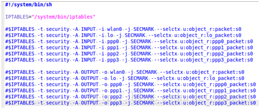
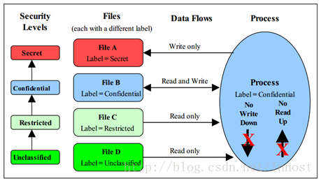
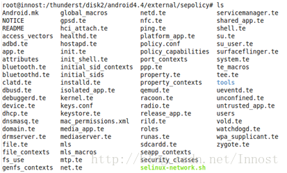
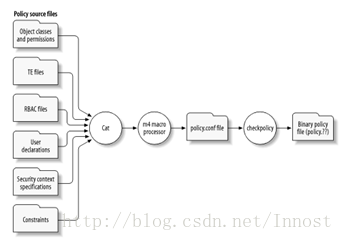
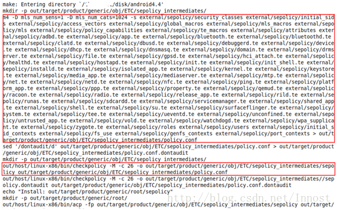

### 2.2.3  File/File System 打label
前面一节中，读者见识到了DT和TT。不过这些描述的都是Transition，即从某种Type或Domain进入另外一种Type或Domain，而上述内容并没有介绍最初的Type怎么来。在SELinux中，对与File相关的死货（比“死东西”少些一个字）还有一些特殊的语句。

直接看SEAndroid中的文件吧。`external/sepolicy/file_contexts`.从file_contexts这个文件名也可看出，该文件描述了死货的SContext。果然：SEAndroid多各种预先存在的文件，目录等都设置了初始的SContext

```
# 注意下面这些*,?号，代表通配符
/dev(/.*)?        u:object_r:device:s0
/dev/akm8973.*        u:object_r:akm_device:s0
/dev/accelerometer    u:object_r:accelerometer_device:s0
/dev/alarm        u:object_r:alarm_device:s0
/dev/android_adb.*    u:object_r:adb_device:s0
/dev/ashmem        u:object_r:ashmem_device:s0
/dev/audio.*        u:object_r:audio_device:s0
/dev/binder        u:object_r:binder_device:s0
/dev/block(/.*)?    u:object_r:block_device:s0
```

注意下面的`--`号，SELinux中类似的符号还有：

* `-b`:- Block Device
* `-c`:- Character Device
* `-d`:-Directory
* `-p`:-Nameed Pipe
* `-l`:-Symbolic Link
* `-s`:-Socket
* `--`:Ordinary file

```
/system(/.*)?        u:object_r:system_file:s0

/system/bin/ash        u:object_r:shell_exec:s0

/system/bin/mksh    u:object_r:shell_exec:s0

/system/bin/sh        --    u:object_r:shell_exec:s0

/system/bin/run-as    --    u:object_r:runas_exec:s0

/system/bin/app_process    u:object_r:zygote_exec:s0

/system/bin/servicemanager    u:object_r:servicemanager_exec:s0

/system/bin/surfaceflinger    u:object_r:surfaceflinger_exec:s0

/system/bin/drmserver    u:object_r:drmserver_exec:s0
```

上面的内容很简单，下面来个面生的：`external/sepolicy/fs_use`fs_use中的fs代表file system.fs_use文件描述了SELinux的labeling信息.在不同文件系统时的处理方式对于常规的文件系统，SContext信息存储在文件节点（inode）的属性中，系统可通过getattr函数读取inode中的SContext信息。对于这种labeling方式，SELinux定义了fs_use_xattr关键词。这种SContext是永远性得保存在文件系统中:

```
fs_use_xattr yaffs2 u:object_r:labeledfs:s0;
fs_use_xattr jffs2 u:object_r:labeledfs:s0;
fs_use_xattr ext2 u:object_r:labeledfs:s0;
fs_use_xattr ext3 u:object_r:labeledfs:s0;
fs_use_xattr ext4 u:object_r:labeledfs:s0;
fs_use_xattr xfs u:object_r:labeledfs:s0;
fs_use_xattr btrfs u:object_r:labeledfs:s0;

#对于虚拟文件系统，即Linux系统运行过程中创建的VFS，则使用fs_use_task关键字描述
#目前也仅有pipefs和sockfs两种VFS格式
fs_use_task pipefs u:object_r:pipefs:s0;
fs_use_task sockfs u:object_r:sockfs:s0;

#还没完，还有一个fs_use_trans，它也是用于Virtual File System，但根据SELinux官方描述，好像这些VFS是针对pseudo terminal和临时对象。
# 在具体labeling的时候，会根据
#fs_use_trans以及TT的规则来来决定最终的SContext
fs_use_trans devpts u:object_r:devpts:s0;
```

假设还有一条TT语句:`type_transition sysadm_t devpts : chr_file sysadm_devpts_t:s0;`

* 表示当sysadm_t的进程在Type为devpts下创建一个chr_file时，其SContext将是sysadm_devpts_t:s0.
* 如果没有这一条TT，则将使用fs_use_trans设置的SContext：u:object_r:devpts:s0 
* 注意，和前面的TT比起来，这里并不是以目录为参考对象，而是以FileSystem为参考对象

```
fs_use_trans tmpfs u:object_r:tmpfs:s0;
fs_use_trans devtmpfs u:object_r:device:s0;
fs_use_trans shm u:object_r:shm:s0;
fs_use_trans mqueue u:object_r:mqueue:s0;
```
到此，我们介绍了fs_use_xattr，fs_use_task和fs_use_trans，那么这三种打标签的方法是否涵盖了所有情况呢？答案肯定是否，因为我们还有一个兄弟没出场呢。

`external/sepolicy/genfs_context`genfs中的gen为generalized之意，即上述三种情况之外的死货，就需要使用genfscon,关键词来打labeling了。一般就是`/`目录，`proc`目录，`sysfs`等

```
genfscon rootfs / u:object_r:rootfs:s0
genfscon proc / u:object_r:proc:s0
genfscon proc /net/xt_qtaguid/ctrl u:object_r:qtaguid_proc:s0
```
到此，绝大部分能想到的死货怎么打标签就介绍完了。

### 2.2.4 给网络数据包/端口打标签
不过，从知识完整性角度看，还有对网络数据包打标签的工作，这也是SELinux新增的功能。不过，它涉及到与iptables相关的工作，所以笔者也不想过多讨论。在SEAndroid中，selinux-network.sh脚本就是来干这个事情的，其内容如图4所示：


由图4可以看出，SEAndroid暂时也没放开网络数据包打标签的功能。"`-j SECMARK --selctx SContext`"是iptables（需要支持SELinux功能）新增选项，用来给各种数据包也打上标签。

除了数据包外，还可以给端口打标签，这是由portcon关键词来完成的。此处不再详述，读者有个概念即可。

## 2.3 Security Level和MLS
### 2.3.1 Security Level
上文介绍的TE，RBAC基本满足了“平等社会”条件下的权限管理，但它无法反映现实社会中等级的概念。为此，SELinux又添加了一种新的权限管理方法，即Multi-Lever Security，多等级安全。多等级安全信息也被添加到SContext中。所以，在MLS启用的情况下（注意，你可以控制SELinux启用用MLS还是不启用MLS），完整的SContext由

* MLS未启用前：`user_u:role_r:type_t`。
* MLS启用后，`user:role:type:sensitivity[:category,...]- sensitivity [:category,...]`。

看，MLS启用后，SContext type后面的字段变得非常复杂，看着有些头晕（至少笔者初学它时是这样的）。下面马上来解释它。

```
|-->low security level<--| -  |-->high security level<--|
sensitivity[:category,...]  - sensitivity [:category,...]
```
上述字符串由三部分组成：

*  `low security level`：表明当前SContext所对应的东西（活的或死的）的当前（也就是最小）安全级别。
*  连字符“-”，表示range
*  `high security level`：表明当前SContext所对应的东西（活的或死的）的最高可能获得的安全级别（英文叫clearance，不知道笔者的中文解释是否正确）。

security level由两部分组成，先来看第一部分由sensitivity关键字定义的sensitivity，其用法见如下例子：用sensitivity定义一个sens_id，alias指定别名。`sensitivity sens_id alias alias_id [ alias_id ];`

```
sensitivity s0 alias unclassified
sensitivity s1 alias seceret
sensitivity s2 alias top-seceret
```

Question：从alias看，似乎so的级别<s1的级别<s2的级别。但是alias并不是sensitivity的必要选项，而且名字可以任取。在SELinux中，真正设置sensitivity级别的是由下面这个关键词表示`dominance {s0 s1 s2.....sn}`,在上述dominance语句中，括号内最左边的s0级别最低，依次递增，直到最右边的sn级别最高

再来看security level第二部分，即category关键字及用法`category cat_id alias alias_id;`

```
category c0
category c1 #等
```
category和sensitivity不同，它定义的是类别，类别之间是没有层级关系的。比如，小说可以是一中cagetory，政府公文是另外一种category，

SEAndroid中：

* sensitivity只定义了s0
* category定义了从c0到c1023，共1024个category。

senstivity和category一起组成了一个security level（以后简称SLevel），SLevel由关键字level声明，如下例所示：

```
#level sens_id [ :category_id ];
#注意，SLevel可以没有category_id。看一个例子：
#sensitivity为s0，category从c0，c1,c2一直到c255，注意其中的.号
level s0:c0.c255;

#没有category_id，如：
level s0
```

和Role类似，SL1和SL2之间的关系有：

* `dom`：如果SL1 dom SL2的话，则SL1的`sensitivity >= SL2`的senstivity，SL1的category包含SL2的category(即Category of SL1是Category of SL2的超集)。如:`SL1="s2:c0.c5" dom SL2="s0:c2,c3"`
* `domby`：和dom相反。
* `eq`：sensitivity相等，category相同。
* `incomp`：不可比。sensitivity不可比，category也不可比。

现在回过头来看SContext，其完整格式为：`user:role:type:sensitivity[:category,...]- sensitivity [:category,...]`

```
#前面例子中，我们看到Android中，SContext有：
u:r:init:s0 #在这种case中，Low SLevel等于High SLevel，而且SLevel没有包含Category
```
好了，知道了SLevel后，下面来看看它如何在MAC中发挥自己的力量。和constrain类似，MLS在其基础上添加了一个功能更强大的mlsconstrain关键字。

### 2.3.2 mlsconstrain和no read down/write up

mlsconstrain语法和constrain一样一样的：`mlsconstrain class perm_set expression;`

和constrain不一样的是，expression除了u1,u2,r1,r2,t1,t2外还新增了：

* `l1,l2`：小写的L。l1表示源的low senstivity level。l2表示target的low sensitivity。
* `h1,h2`：小写的H。h1表示源的high senstivity level。h2表示target的high sensitivity。
* `l和h的关系`，包括dom,domby,eq和incomp。

mlsconstrain只是一个Policy语法，那么我们应该如何充分利用它来体现多层级安全管理呢？来看图5。



MLS在安全策略上有一个形象的描述叫no write down和no read up：

* 高级别的东西不能往低级别的东西里边写数据：这样可能导致高级别的数据泄露到低级别中。如图4中，Process的级别是Confidential，它可以往同级别的File B中读写数据，但是只能往高级别的File A(级别是Secret)里边写东西。
* 高级别的东西只能从低级别的东西里边读数据：比如Process可以从File C和File D中读数据，但是不能往File C和File D上写数据。

反过来说：

* 1低级别的东西只能往高级别的东西里边写数据
	* -----我和小伙伴们解释这一条的时候，小伙伴惊呆了，我也惊呆了。他们的想法是”低级别往高级别里写，岂不是把数据破坏了？“。晕！这里讨论的是泄不泄密的问题，不是讨论数据被破坏的事情。破坏就破坏了，只要没泄密就完了。
* 2低级别的东西不能从高级别的东西那边读数据

### 2.3.3 MLS in SEAndroid

再来看看SEAndroid中的MLS：

* 首先，系统中只有一个sensitivity level，即s0。
* 系统中有1024个category，从c0到c1023。

读者通过`mmm external/sepolicy --just-print`可以打印出sepolicy的makefile执行情况，其中有这样的内容：

```
#m4用来处理Policy文件中的宏
m4 -D mls_num_sens=1 -D mls_num_cats=1024
```
在`external/sepolicy/mls`文件中有：`external/sepolicy/mls`

```
#SEAndroid定义的两个和MLS相关的宏，位于mls_macro文件中
gen_sens(mls_num_sens)  #mls_num_sens=1
gen_cats(mls_num_cats)  #mls_num_cats=1024

#下面这个宏生成SLevel
gen_levels(mls_num_sens,mls_num_cats)
```

没必要解释上面的宏了，最终的policy.conf中（2.4节将介绍它是怎么来的），我们可以看到：`out/target/product/generic/obj/ETC/sepolicy_intermediates/policy.conf`

```
sensitivity s0;
dominance { s0  }
category c0;
......#目前能告诉大家的是，policy.conf文件中，宏，attribute等都会被一一处理喔！
category c1023; 
level s0:c0.c1023; #定义SLevel
#SEAndroid中，mls_systemlow宏取值为s0
#mls_systemhigh宏取值为s0:c0.c1023
user u roles { r } level s0 range s0 - s0:c0.c1023; #定义u
```

最后，来看一下mlsconstain的例子：

```
mlsconstrain dir search
(( l1 dom l2 ) or
(( t1 == mlsfilereadtoclr ) and ( h1 dom l2 )) or
( t1 == mlsfileread ) or
( t2 == mlstrustedobject ));
#上述标粗体的都是attribute
```

## 2.4 编译安全策略文件
到此，SELinux Policy语言中的基本要素都讲解完毕，相信读者对着真实的策略文件再仔细研究下就能彻底搞明白。

不过，我们前面反复提到的安全策略文件到底是什么？我们前面看到的例子似乎都是文本文件，难道就它们是安全策略文件吗？

拿个例子说事，来看图6中Android的策略文件：



Android中，SELinux的安全策略文件如图6所示。这么多文件，如何处理呢？



* 左边一列代表安全配置的源文件。也即是大家在图6中看到的各种te文件，还有一些特殊的文件，例如前文提到的initial_sid，initial_sid_contexts，access_vectors、fs_use,genfs_contexts等。在这些文件中，我们要改的一般也是针对TE文件，其他文件由于和kernel内部的LSM等模块相关，所以除了厂家定制外，我们很难有机会去修改。
* 这些文件都是文本文件，它们会被组合到一起（图7中是用cat命令，不同平台处理方法不相同，但大致意思就是要把这些源文件的内容搞到一起去）。
* 搞到一起后的文件中有使用宏的地方，这时要利用m4命令对这些宏进行拓展。m4命令处理完后得到的文件叫policy.conf。前面我们也见过这个文件了，它是所有安全策略源文件的集合，宏也被替换。所以，读者可以通过policy.conf文件查看整个系统的安全配置情况，而不用到图6中那一堆文件中去找来找去的。
* policy.conf文件最终要被checkpolicy命令处理。该命令要检查neverallow是否被违背，语法是否正确等。最后，checkpolicy会将policy.conf打包生成一个二进制文件。在SEAndroid中，该文件叫sepolicy，而在Linux发行版本上，一般叫policy.26等名字。26表示SELinux的版本号。
最后，我们再把这个sepolicy文件传递到kernel LSM中，整个安全策略配置就算完成。

提示：请读者务必将上述步骤搞清楚。

图8所示为SEAndroid中sepolicy makefile的执行情况：



#### 提示：

想知道如何打印make命令的执行情况？请使用“--just-print”选项

#### 进阶阅读：

* 1.上述做法是将所有源文件打包生成一个单一的安全策略文件，这种方式叫Monolithic policy。显然，在什么都模块化的今天，这种方式虽然用得最多，但还是比较土。SELinux还支持另外一种所谓的模块化Policy。这种Policy分Base Policy和Module Policy两个。BasePolicy为基础，先加载，然后可以根据情况动态加载Module Policy目前SEAndroid还没有该功能，不过以后可能会支持。相信有了它，开发定制企业级安全管理系统就更方便些。
* 2.安全策略源文件非常多。基本上，我们都会在一个参考源文件上进行相应修改，而不会完全从头到尾都自己写。所以，在发行版上有一个Reference Policy，里边涵盖了普适的，常用的策略。很明显，AOSP 4.4中的sepolicy也提供了针对Android平台的Reference Policy.

### 2.3.5  拓展讨论
